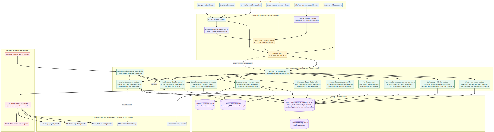

# Supported Accommodation Hub — Technical System Architecture

**Architecture baseline:** MySQL-backed local authentication release in progress, following published release `2f5a873b`.  
**Prepared for:** Technical delivery, security and operations teams.  
**Date:** 7 September 2026.  
**Scope:** A backend-ready logical and deployment architecture for a multi-entity supported-accommodation operations platform. It distinguishes **implemented baseline controls**, **credential-ready patterns**, and **production decisions still requiring organisational approval**.

## 1. Architecture intent and boundaries

The Hub is a **modular monolith**: a React client uses typed tRPC procedures provided by Express, with Drizzle persisting to MySQL/TiDB and private object storage holding binary evidence. This retains one transaction boundary and one server-side enforcement layer while the operating model is still evolving. It should not be split into separately deployed microservices until team ownership, integration volume, throughput or isolation requirements create a concrete reason to do so. [1] [2]

> **Core rule:** MySQL credential verification proves only that the supplied email and password match a local active account. The Hub independently derives whether that user has an active entity membership, capability, property scope, placement assignment and sufficient sensitivity/state authority for the requested action.

| Architectural objective | Implemented response | Production decision still required |
|---|---|---|
| Tenant isolation | Entity-scoped records; server checks membership and scope | Access-review cadence and automated deprovisioning policy |
| Least privilege | Capability, property and placement checks run server-side | Formal policy-as-code review ownership |
| Local email/password sign-in | MySQL credentials with salted one-way hashes, lockout state and signed sessions | MFA strategy, password rotation policy and authentication-monitoring ownership |
| Colleague onboarding | Company-scoped pre-authorisation followed by audited credential issue | Approved secure temporary-password/reset-link delivery process |
| Evidence safety | Relational metadata plus private object-storage bytes | Scanner, object-lock and data-loss-prevention provider |
| Auditability | Append-only hash-linked audit records with object-store receipts | SIEM retention, alerting and incident-response integration |

## 2. Full system context

The diagram separates five trust boundaries. End users, guests and external webhooks are untrusted clients. The local-authentication and edge boundary handles HTTPS, MySQL credential verification, one-time owner bootstrap and signed sessions. The Hub contains logical modules that share a database transaction boundary but retain separate domain ownership. Managed data services hold relational facts and binary evidence separately. Scheduler and optional provider adapters are isolated from browser-initiated actions. [1] [3]

| Boundary | Entry points | Trust requirements |
|---|---|---|
| User/client | Manager, Key Worker, company administrator and restricted guest views | Browser data and route values are untrusted; client visibility is never an authorisation decision |
| Local authentication/edge | Email/password sign-in, one-time owner bootstrap, session cookie, API request | Salted one-way hashes; generic failures; temporary lockout; HTTP-only version-revocable sessions; HTTPS |
| Hub application | `/api/trpc`, controlled public secure-link procedures, authenticated job endpoint | Input validation; tenant, property, placement, sensitivity and record-state checks; audit evidence |
| Data | MySQL/TiDB and private object storage | Database holds state/scope/hash metadata; object storage holds documents, PDFs and audit receipts |
| External/async | Scheduler, webhooks and optional adapters | Authenticated callbacks, idempotency, approved connections and durable delivery receipts |

## 3. Identity, colleague provisioning and authorisation

### 3.1 Current local credential flow

The sign-in endpoint normalises the supplied email, looks up the corresponding MySQL credential, verifies its salted one-way scrypt hash and creates a signed HTTP-only session only on success. Generic credential errors prevent account enumeration. Five consecutive failures cause a temporary lockout; a password update increments a version in MySQL, invalidating prior local sessions. The first approved owner uses a high-entropy one-time bootstrap token to establish the first credential. [3] [4]

### 3.2 Colleague provisioning flow

The **Hub-side pre-authorisation** workflow is intentionally separate from credential issue. A company administrator records a colleague’s email, non-owner operational role, all-property or named-property scope, approved exception capabilities, expiry and reason. The administrator can then issue a strong temporary password only where an active membership or matching pending pre-authorisation exists.

When a company administrator issues local credentials to an approved pending colleague, the Hub creates the tenant membership and any named property grants, marks the pre-authorisation accepted and writes restricted audit evidence. An existing membership is never overwritten by a pre-authorisation. [3] [5]

| Stage | Owner | System action | Safety control |
|---|---|---|---|
| Pre-authorise Hub scope | Company administrator | Records email, role, property scope, expiry and reason | `config.write`, tenant property validation and audit evidence |
| Issue credential | Company administrator | Issues a strong temporary local password to an active or pending approved colleague | Password is one-way hashed; no plaintext persistence; business reason and audit event |
| Sign in | Colleague | Uses email and local password | Generic failures, five-attempt temporary lockout and signed versioned session |
| Activate access | Hub service | Creates active membership/property grants for a matching pending invitation during authorised credential issue | No replacement of existing membership; audit event |
| Revoke before use | Company administrator | Marks pending pre-authorisation revoked | `config.write`, meaningful reason and audit evidence |
| Remove access after use | Company administrator | Uses existing access-control workflow to suspend/end membership and remove grants | Server-authoritative RBAC and property scope checks |

### 3.3 Authorisation decision order

Every protected procedure follows this order: **valid authenticated session → active local account → active entity membership → role/capability → property scope → placement assignment for frontline access → sensitivity and record-state constraints → allow/deny audit event**. The order is evaluated on the server; neither a client-supplied entity ID nor a navigation item confers authority. [2] [5]

## 4. Logical application modules

| Module | Primary ownership | Scope keys | Sensitive classes | Authoritative state changes |
|---|---|---|---|---|
| Identity and access | Users, memberships, roles, capability and property/placement grants | User, entity, property, placement | Restricted | Membership activation, suspension, scope grant and role change |
| Colleague provisioning | Pending pre-authorisations and accepted identity matches | Email, entity, property | Restricted | Pending → accepted, revoked or expired |
| Accommodation and operations | Entities, properties, units, occupancy, placements, rota and timesheets | Entity, property, placement | General/restricted | Property, placement, shift and approval transitions |
| Workforce | Staff profile, recruitment, checks, training and supervision | Entity, property, staff | HR | Staff lifecycle and evidence status |
| Care and safeguarding | Key Worker records, medication, incidents, allegations and reviews | Entity, property, placement | Safeguarding/health | Restricted documentation, review and closure transitions |
| Compliance and governance | Obligations, evidence, quality, statutory review and work plans | Entity, property, staff | General/restricted | Evidence approval, due-state and action completion |
| Finance and controlled sharing | Fees, invoices, statements, packs and secure links | Entity, property, local authority | Finance/bank | Immutable invoice snapshots, payment allocation, link lifecycle |
| Documents, audit and retention | Metadata, versions, legal holds, audit records and receipts | Entity, record, document | Restricted | Version append, retention hold and audit hash chain |
| Notification and outbox | In-app reminders, delivery intents and provider receipts | Entity, user, delivery | General/restricted | Idempotent notification/delivery attempt lifecycle |

## 5. Data architecture and invariants

The relational database is the source of truth for scope, relationships, lifecycle state, approvals, metadata and hashes. Private object storage is the source of truth for binary evidence, generated PDFs and audit receipt bodies. This division prevents document bytes being duplicated into relational BLOB columns and supports controlled download through authorised metadata checks. [1] [2]

| Data group | Examples | Required invariant |
|---|---|---|
| Identity and tenant access | `users`, `localAuthCredentials`, `entityMemberships`, `propertyAssignments`, colleague invitations | Credential verification alone does not grant tenant access; active membership remains required |
| Care and safeguarding | Placements, Key Worker reports, incidents and health content | Frontline access depends on active assignment and restricted handling |
| Finance | Fees, invoices, statement archives and payment allocations | Issued records are immutable snapshots with scoped finance access |
| Documents/evidence | Metadata, versions, folders, retention and object keys | Bytes remain outside DB; metadata is authorised before access |
| Audit | Events, hash pointers and receipt mirrors | Append-only evidence with minimal metadata and no plaintext invitation token |
| Delivery | Connection settings, outbox, attempts and receipts | Outbound delivery is idempotent and disabled until provider activation |

## 6. API, scheduler and integration patterns

Internal browser traffic uses typed tRPC at `/api/trpc`. Public flows are deliberately narrow, such as guest property-summary link redemption. A scheduled job enters through an authenticated endpoint and performs deterministic due-state evaluation. Browser forms never call mail, scanning, accounting, e-signature or other suppliers directly. [1] [6]

For production integrations, a business transaction must persist both the domain state and a delivery-intent/outbox record. An approved dispatcher later sends only through an active connection, captures attempts and receipts, honours retry/backoff policy and routes persistent failures to review. Supplier webhooks must verify a signature, use idempotency keys and minimise data. The present baseline has email-ready records but does not claim live email delivery. [1]

## 7. Deployment and resilience target

The appropriate production target is stateless Hub API instances behind HTTPS edge protection, a managed HA MySQL-compatible database, private encrypted object storage and a managed scheduler. The application must not rely on sandbox local files or permanently running background workers.

| Area | Target control |
|---|---|
| Compute | Stateless containers behind managed HTTPS gateway, health checks and autoscaling |
| Secrets | Managed store, least-privilege service identities, rotation runbook and no committed credentials |
| Database | TLS, encrypted backups, point-in-time recovery, tested restore, migration gates and non-production separation |
| Object storage | Private encrypted bucket, scoped keys, retention/lifecycle policy, quarantine area and presigned retrieval only |
| Observability | Correlation IDs, structured logs, request/job/delivery metrics, audit-receipt failure alerts and secure error codes |
| Security assurance | Dependency scanning, SAST, secret scanning, access review, penetration test and tested incident response |

## 8. Current baseline versus production target

| Capability | Current state | Production target / decision |
|---|---|---|
| Local sign-in | MySQL credential table with salted hashes, lockout, reset and versioned signed sessions | MFA strategy, password rotation policy and authentication monitoring |
| Colleague scope activation | Company-scoped pre-authorisation and audited administrator credential issue | Secure temporary-password/reset-link delivery process and joiner/mover/leaver ownership |
| Guest access | Narrow property-summary links, hash-only tokens, expiry/revocation/use limit | Formal external sharing assessment before any broader scope |
| Email/SMS | In-app and email-ready outbox only | Configure provider, sender domain, consent wording and receipt monitoring |
| Document scanning | Metadata/quarantine model | Choose scanner, service level and review process |
| Audit | Hash-linked events and object-store receipt mirror | SIEM integration, retention schedule and incident alerting |
| DR | Managed project deployment and schema checks | Agree RTO/RPO, regional posture, restore test cadence and accountable owner |

## 9. Production decision register

| Decision | Owner | Required before | Due date |
|---|---|---|---|
| MFA, password rotation and session policy | Security/IT lead | Onboarding production staff | To be set |
| Account joiner/mover/leaver and deprovisioning process | HR/operations + IT lead | First production colleague | To be set |
| Local credential issuance and reset-link delivery policy | Security lead | Colleague pre-authorisation use | To be set |
| Sender domain and outbound notification provider | Operations/IT lead | Live email/SMS | To be set |
| Data residency, DPIA, retention and legal-hold policy | Data-protection lead | Live sensitive records | To be set |
| Backup, restoration and incident targets | Technical lead | Production go-live | To be set |
| Malware scanning and evidence quarantine process | Security/operations lead | External evidence uploads | To be set |

## 10. Technical-team delivery sequence

1. Stabilise identity, active account, membership, capability, property and placement enforcement with negative tests.
2. Establish the first local owner credential with a one-time bootstrap token; pre-authorise Hub scope through company administration; issue credentials through an approved channel and validate first sign-in/audit acceptance.
3. Complete operational, care, compliance, finance and document modules with encryption, state transitions and audit evidence.
4. Activate external adapters only after credentials, sender/domain verification, supplier testing, signed webhook contracts and support ownership are approved.
5. Complete production assurance: migration rehearsal, backup/restore test, access review, performance test, security review, accessibility review and incident exercise.

## 11. Developer handoff checklist

- Preserve server-side authorisation; do not use client routing or visible controls as a security boundary.
- Treat local credential verification as authentication only; require local active membership and scope for every protected Hub action.
- Do not auto-create owner access from colleague pre-authorisation, and never overwrite a live membership during invitation acceptance.
- Use object storage for bytes and relational storage for metadata, state, scope, classification and hashes.
- Keep every external call behind a controlled adapter, durable outbox, idempotency contract and audit trail.
- Keep sensitive values and raw provider diagnostics out of browser-visible errors, diagrams, logs and support templates.

## References

[1]: [Existing backend solution architecture](./backend-solution-architecture.md)
[2]: [Canonical server authorisation model](../server/authz.ts)
[3]: [Local authentication router](../server/routers/localAuth.ts)
[4]: [Local credential and reset service](../server/services/localAuth.ts)
[5]: [Signed local-session verification](../server/_core/sdk.ts)
[6]: [Application API and job-route registration](../server/_core/index.ts)
